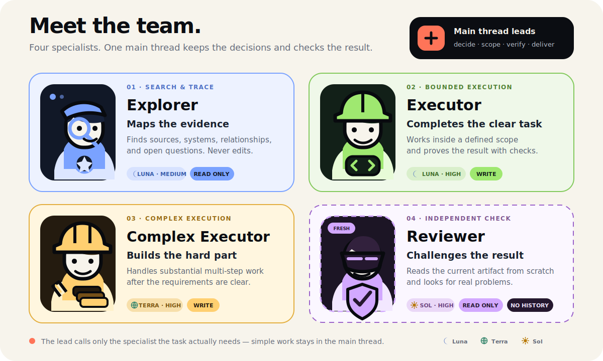

<p align="right">
  <a href="./README.md">English</a> · <strong>简体中文</strong>
</p>

<p align="center">
  
</p>

`dev-team` 是一个负责协调四个自定义开发 Agent 的 Codex Skill。主线程带领任务、保留尚未解决的决策并验收最终结果；子 Agent 负责适合专注上下文、较低成本或安全并行的工作。

它提供的是调度方法，不要求每次走完固定流程。

## 四个角色

- **Explorer（看代码小子）· Luna Medium · 只读**：探索代码、数据库结构、API、日志和配置，不修改文件。
- **Executor（写代码小子）· Luna Medium · 可写**：处理目标清楚、范围局部、风险较低，而且能明确验证的实现。
- **Complex Executor（写难代码小子）· Sol High · 可写**：处理复杂但边界明确的实现。
- **Reviewer（Review 小子）· Sol High · 只读**：独立复审稳定的改动、方案和测试策略。

Luna 承担日常探索和实现，控制成本；Sol 留给复杂执行与独立复审，因为这些环节漏掉关键细节的代价更高。

## 怎么调度

- 需要一定范围探索的工作交给 `Explorer`；主线程可以等待结果，不重复探索同一件事。
- 探索完成后，主线程根据上下文、成本、风险和协调价值，决定自己实现还是继续委派。
- 同一任务、业务领域或子系统的已有上下文仍然有用时，复用原来的 Explorer 或执行者。上下文已经过时、变得混乱，或可能影响独立判断时，新建一个 Agent。
- 每次新的 `Reviewer` 都不继承历史对话。它只看待审内容和中立要求，不看之前的争论和预期结论。
- 只有互不依赖的工作才并行。同一个工作区同时只保留一个写入者。
- 主线程会检查真实 Diff 和验证结果，再决定是否接受子 Agent 的工作。

## 安装

先安装 Skill：

```bash
npx skills add oil-oil/codex-dev-team
```

四个自定义 Agent 配置与 Skill 分开安装。个人使用时，把 [`agents/`](./agents) 里的 TOML 模板复制到 `~/.codex/agents/`；只给单个项目使用时，复制到 `<repository>/.codex/agents/`。

准确文件名、安全安装、验证、修复和模型调整都写在 [自定义 Agent 配置说明](./skills/dev-team/references/custom-agents.md) 里。如果安装后没有立即显示新的 Agent，可以新建一个 Codex 任务或重启 Codex。

## 使用

开发任务达到一定规模时，这个 Skill 可以自动触发。你也可以明确调用：

```text
使用 $dev-team 完成这个仓库任务。把需要一定范围的探索交给 Explorer，再根据上下文、成本、风险和协调价值决定由谁实现。复杂或高风险结果需要独立复审。
```

用户不用逐个指定 Agent。主线程会选择够用的最小团队，并对汇总后的结果负责。

## 自定义

你可以修改 `agents/*.toml` 中的 `model` 和 `model_reasoning_effort`。角色边界建议保留：Explorer 和 Reviewer 只读，写入权限只交给执行者，新的复审使用全新上下文，最终验收留在主线程。

## 仓库结构

```text
codex-dev-team/
├── agents/                  # 四个 Codex 自定义 Agent 模板
├── assets/readme/           # GitHub-safe SVG 视觉素材
├── skills/dev-team/         # 可以安装的 Skill
│   ├── agents/openai.yaml
│   ├── references/custom-agents.md
│   └── SKILL.md
├── LICENSE
└── README.md
```

<p align="center">
  <a href="https://github.com/oil-oil/beautify-github-readme"></a>
</p>

MIT License
